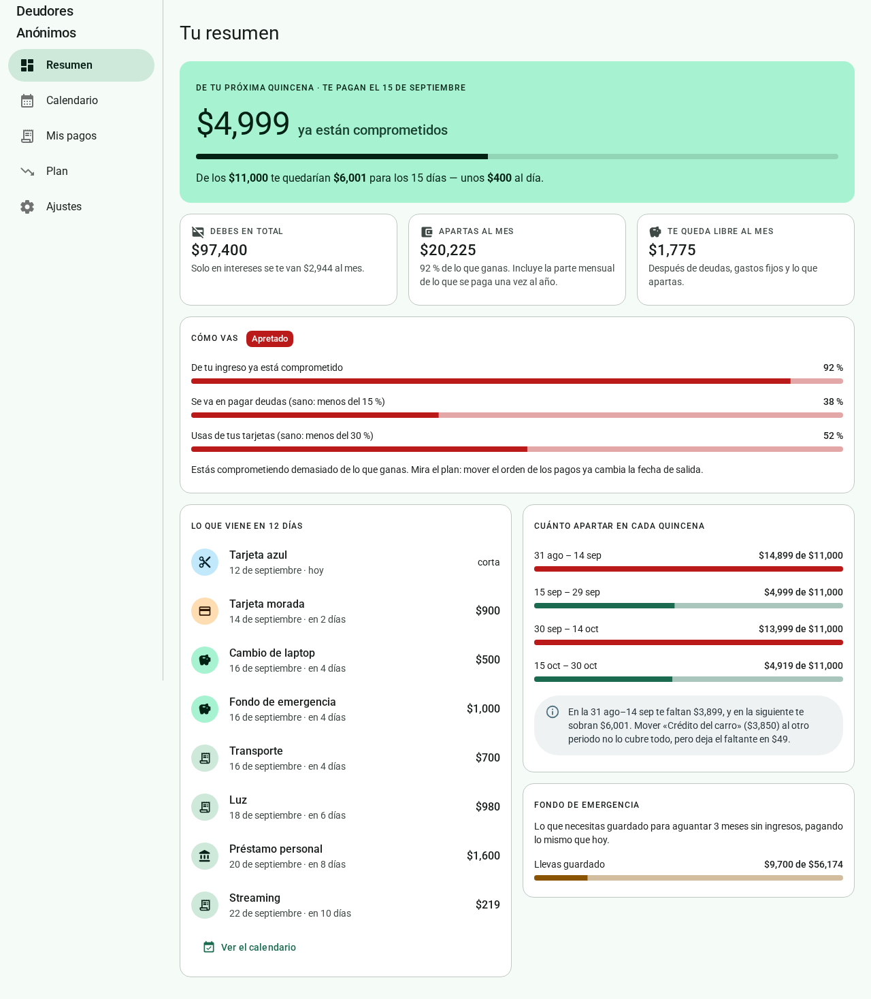
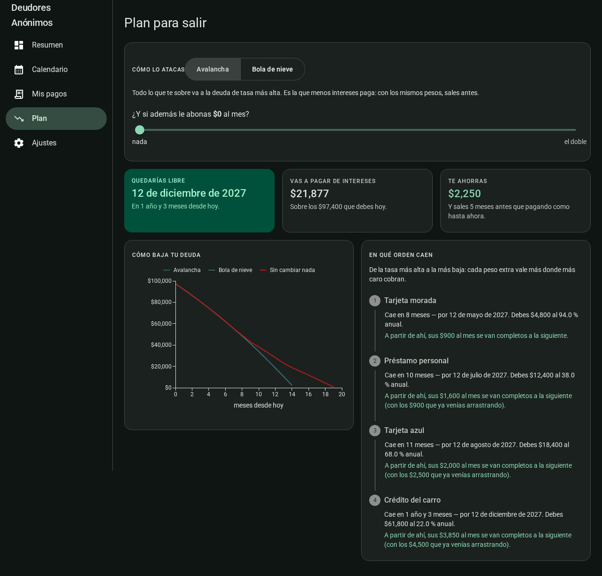
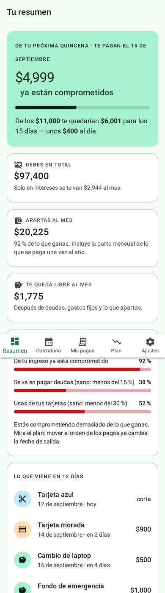

# Deudores Anónimos

**Organiza tus deudas sin contarle tu vida a nadie.** Tarjetas, préstamos, renta,
suscripciones y ahorro en un solo lugar, para responder la pregunta que ninguna app
de banco responde: *de la quincena que me van a pagar, ¿cuánto ya no es mío?*

No hay cuenta, no hay servidor y no hay analítica. **Todo vive en tu navegador**, se
descarga como un JSON y se borra con un botón. De ahí el nombre.

🔗 **[luisaldrichguz.net/deudas](https://luisaldrichguz.net/deudas/)** · se instala como
app en el celular y funciona sin internet.



---

## El problema

Las apps de finanzas personales te piden conectar tus cuentas bancarias y te devuelven
un reporte de lo que **ya** gastaste. Eso no cambia ninguna decisión: para cuando lo
ves, el dinero ya se fue.

Lo que sí cambia una decisión es saber, **antes** de gastarlo, cuánto de tu próximo
pago está comprometido. Y para eso no hace falta tu banco: hace falta tu calendario.

## Lo que hace

| | |
|---|---|
| **Dinero comprometido** | De tu próxima quincena, cuánto ya está apartado y cuánto te queda por día |
| **Reparto por periodo** | Cuánto guardar en cada quincena, y **qué pago mover** cuando una va apretada y la otra sobrada |
| **Calendario** | Cortes de tarjeta, fechas límite, recibos y lo que apartas, en un mes |
| **Días sin intereses** | Cuántos te dan si compras hoy con cada tarjeta, y **cuál es el mejor día para comprar** |
| **Lo que quemas** | Cuánto se va en puros intereses cada mes, sin bajar un peso del saldo |
| **Plan de salida** | Avalancha vs. bola de nieve, con la fecha exacta en que quedas libre y cuánto te ahorras |
| **¿Y si abono más?** | Un deslizador que recalcula la fecha de salida en vivo |
| **Apartado mensual real** | La parte proporcional de lo que se paga una vez al año (tenencia, seguro, predial) |
| **Fondo de emergencia** | Cuánto necesitas guardado para aguantar N meses pagando lo mismo |
| **Semáforo** | Tres porcentajes con los mismos cortes que usa un banco para decidir si te presta |

Tres detalles que casi nadie implementa y que aquí sí están:

- **Si un pago no cubre ni los intereses, lo dice con nombre y apellido** en vez de
  dibujar una fecha de salida imposible.
- **Los gastos que no son mensuales se prorratean.** El seguro del coche no se paga en
  marzo: se paga todo el año, de a poquito.
- **El pago liberado se reinvierte.** Cuando una deuda cae, su mensualidad se suma al
  ataque de la siguiente — que es todo el truco de la bola de nieve, y el plan lo
  explica paso por paso.

<p align="center">
  
  
</p>

## La privacidad no es una promesa, es la arquitectura

No es que los datos estén "seguros en nuestros servidores". Es que **no hay servidores**:

- Cero llamadas de red en todo el código de la app. No hay `fetch`, no hay SDK de
  analítica, no hay fuentes de Google (Roboto va empaquetada).
- La persistencia entra y sale por **una sola interfaz** (`AlmacenDeDatos`, 4 métodos).
  El adaptador por omisión escribe en `localStorage` y nada más.
- Se sirve con una CSP que bloquea cualquier origen externo, así que aunque una
  dependencia intentara llamar a casa, el navegador lo corta.

Lo puedes verificar tú mismo sin leer una línea: abre las herramientas de desarrollo,
pestaña **Red**, y usa la app un rato. No se mueve nada.

→ El detalle, y lo que **no** protege: **[docs/seguridad.md](docs/seguridad.md)**

## Correrlo

```bash
npm install
npm run dev      # http://localhost:5183/deudas/
npm run build    # typecheck + build de producción
```

Node 20 o superior. No hay base de datos, ni `.env`, ni servicios que levantar.

## Cómo está armado

```
src/
  app/            arranque, tema, rutas y el armazón de navegación
  features/       una carpeta por lo que el usuario hace
    bienvenida/   resumen/   calendario/   compromisos/   plan/   ajustes/
  shared/
    almacen/      el modelo de datos y el puerto de persistencia
    finanzas/     TODA la matemática: fechas, intereses, periodos, estrategias
    formato/      cómo se ve el dinero
    ui/           las piezas que usan dos o más features
```

Dos reglas que explican casi todas las decisiones del repo:

1. **La matemática no sabe que existe React.** `shared/finanzas/` son funciones puras
   sobre objetos planos. Se pueden probar, portar a otro framework o correr en un
   servidor sin tocar una línea.
2. **Nada sube a `shared/` hasta que lo pide un segundo consumidor.** No hay
   abstracciones "por si luego".

→ El mapa completo: **[docs/arquitectura.md](docs/arquitectura.md)**

## ¿Y si le quiero poner backend?

Está pensado para eso desde el primer commit. Toda la persistencia pasa por una
interfaz de cuatro métodos, y todos devuelven `Promise` precisamente para que el día
que haya red no haya que cambiar ni una firma:

```ts
export interface AlmacenDeDatos {
  readonly nombre: string
  cargar(): Promise<Datos | null>
  guardar(datos: Datos): Promise<void>
  limpiar(): Promise<void>
}
```

Escribes tu adaptador, lo pasas al proveedor y ya. **Ningún componente cambia.**

→ Guía completa, con ejemplo y las trampas: **[docs/integrar-un-backend.md](docs/integrar-un-backend.md)**

## Stack

React 19 · TypeScript en modo estricto · MUI 9 (Material Design 3) · Vite 8 ·
`vite-plugin-pwa` (Workbox). Sin backend, sin estado global, sin CSS-in-JS propio.

| Documento | Qué contiene |
|---|---|
| [docs/arquitectura.md](docs/arquitectura.md) | Las capas, por qué están así y dónde va cada cosa nueva |
| [docs/calidad.md](docs/calidad.md) | Las reglas que sigue este código y cómo revisar un cambio |
| [docs/seguridad.md](docs/seguridad.md) | El modelo de amenazas, qué protege y qué **no** |
| [docs/integrar-un-backend.md](docs/integrar-un-backend.md) | Cómo cambiar el navegador por una API |
| [CHANGELOG.md](CHANGELOG.md) | Qué entró en cada versión |

## Licencia

MIT — **[LICENSE](LICENSE)**. Úsalo, cópialo, véndelo. Si te sirvió, un ⭐ se agradece.

Hecho por [Luis Aldrich Guzmán](https://luisaldrichguz.net).
